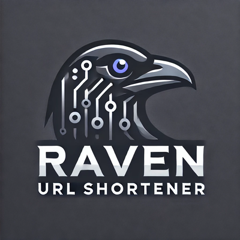
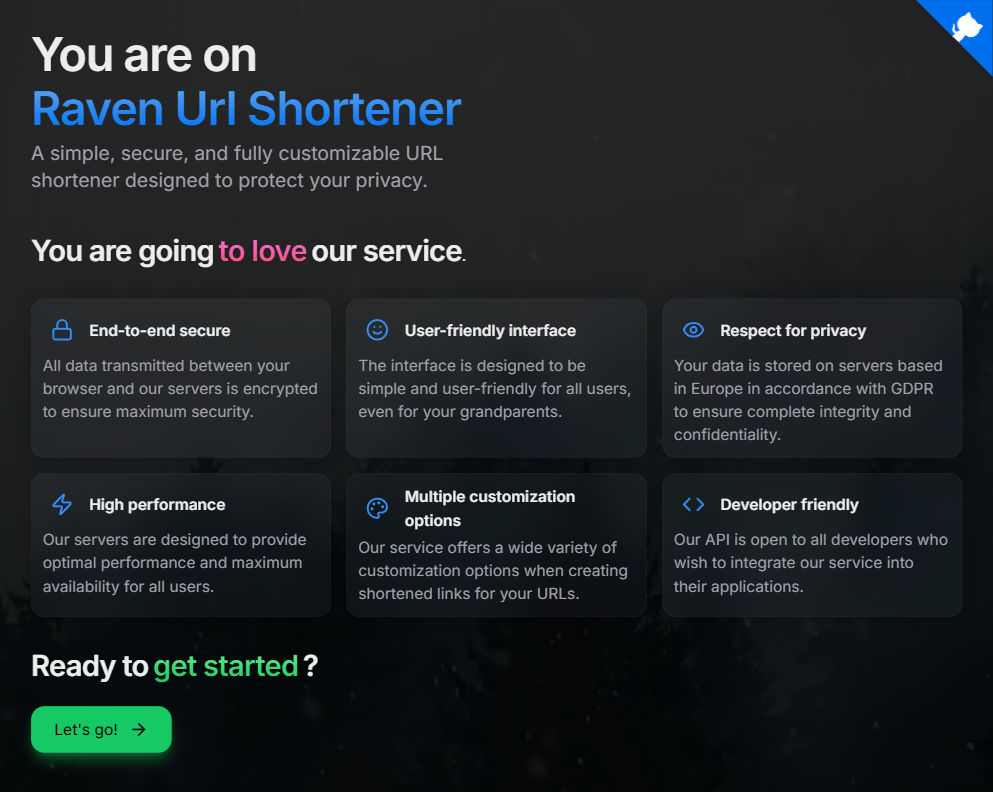

# 🔗 Raven Url Shortener

## In French

Voici l'un de mes projets les plus aboutis à ce jour : **un service de raccourcissement de liens Internet (URL)**, inspiré du célèbre [Cparlà](https://cpar.la/) réalisé par... [mon entreprise](https://ciblemut.net/) !, mais avec une approche personnelle plus **moderne**, **personnalisable**, centrée sur la **sécurité** et la **confidentialité**.

Le projet a été conçu avec une séparation **claire** entre le *front-end* et le *back-end*, permettant à chaque partie d'évoluer indépendamment. Le *front-end* repose actuellement sur [NextJS](https://nextjs.org/) 🤕, ma technologie de prédilection, mais une migration vers [SvelteKit](https://svelte.dev/docs/kit/introduction) 💘 est prévue afin de se débarrasser de ce qu'est devenu l'écosystème React, que je considère aujourd'hui comme une **horreur**.

Le *back-end*, quant à lui, est construit sur le solide *framework* [Symfony](https://symfony.com/) 💪, et expose une API REST qui alimente le *front-end*, le rendant ainsi **totalement agnostique** vis-à-vis des évolutions futures. Ce *back-end* a également été pensé pour être utilisé par d'**autres services**, ce qui permet d'intégrer ce raccourcisseur à d'autres applications. Une documentation [Swagger](https://swagger.io/) (**en anglais uniquement**) a bien sûr été mise en place pour faciliter l'utilisation de l'API et accessible [ici](https://url.florian-dev.fr/api/docs).

À terme, toutes les nouvelles fonctionnalités seront d'abord implémentées côté API avant d'être intégrées dans le front-end, **garantissant ainsi une cohérence et une évolutivité optimales du projet**.

> [!TIP]
> Voir le fichier [SETUP.md](SETUP.md) pour consulter les instructions d'installation.

> [!IMPORTANT]
> L'entièreté du code de ce projet est commenté dans ma langue natale (en français) et n'est pas voué à être traduit en anglais par soucis de simplicité de développement.

## In English

Here's one of my most successful projects to date: **an URL shortener service**, inspired by the famous [Cparlà](https://cpar.la/) created by... [my company](https://ciblemut.net/)!, but with a more **modern**, **personalizable**, **security** and **confidentiality** approach of my own.

The project was designed with a **clear** separation between the front-end and the back-end, allowing each part to evolve independently. The front-end is currently based on [NextJS](https://nextjs.org/) 🤕, my technology of choice, but a migration to [SvelteKit](https://svelte.dev/docs/kit/introduction) 💘 is planned to get rid of what React's ecosystem has become, which I now consider a **nightmare**.

The back-end, on the other hand, is built on the solid [Symfony](https://symfony.com/) 💪 framework and exposes a REST API that powers the front-end, making it **totally agnostic** to future evolutions. This back-end was also designed to be used by **other services**, allowing this URL shortener to be integrated into other applications. A [Swagger](https://swagger.io/) documentation has of course been set up to make the API easier to use and is accessible [here](https://url.florian-dev.fr/api/docs).

Ultimately, all new functionalities will first be implemented on API before being integrated into the front-end, **ensuring optimal project consistency and scalability**.

> [!TIP]
> See the [SETUP.md](SETUP.md) file for setup instructions.

> [!IMPORTANT]
> The whole code of this project is commented in my native language (in French) and will not be translated in English for easier programming.

